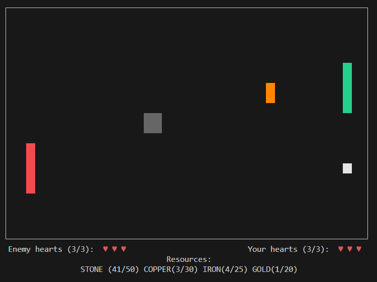
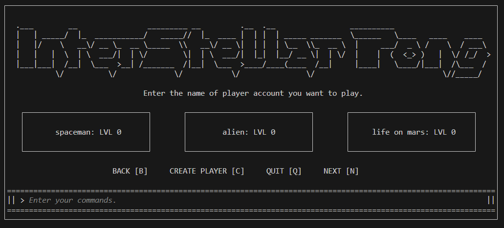
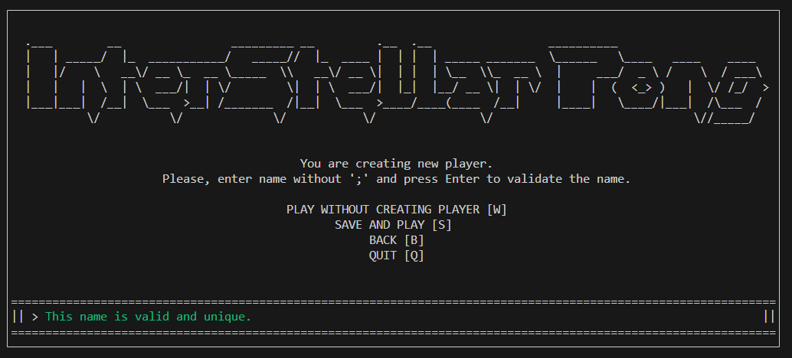
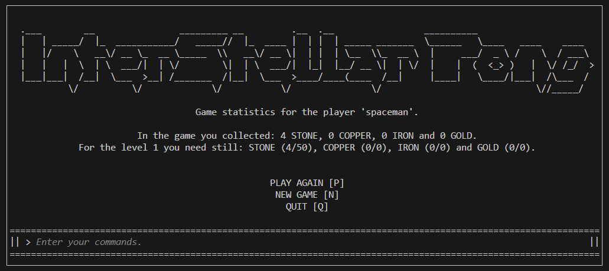

# InterStellar Pong - v1.2.0

Welcome to InterStellar Pong, a simple terminal-based game inspired by the classic Pong with an exciting twist!
In this game, you'll not only play Pong but also collect valuable resources like stone, iron, copper, and gold to progress through higher levels.



You can also create and play with different players' accounts!



Creating new player is as easy as it can be.



Your progress through the game is being watched so you know where you are.




## Features

- Classic Pong gameplay with resource collection.
- Gather stone, iron, copper, and gold to advance.
- Simple page "engine" for account management and player creation.
- Custom library for page rendering and visuals.

## Installation

#### To play InterStellar Pong, follow these steps.

- Clone the repository:

   ```bash
   git clone https://github.com/kerrambit/InterStellar-Pong && cd InterStellar-Pong

- Build (the build is guaranteed to run without problems for at least version gcc-11):

   ```bash
   chmod +x build.sh && ./build.sh

- Run:

   ```bash
   chmod +x launch.sh && ./launch.sh
   
- You can also run the game in debugging mode. Just like this:
    ```bash
   ./lauch.sh debug
   ``` 


## Bug Fixes
- **v1.0.0-beta**
  - Fixed: Issue with game crashing after the user runs the game for the first time and chosses to play without creating player (error log: "[ERROR] - [Application Error]: file with data was not found.").
  - Description: The game was crashing due to the fact, that program tried to update data in players.data file, however, such a file did not exist at the moment.

## Version History
- **v1.1.0-beta**
  - This version introduces enhancements to the enemy paddle movement, resulting in smoother gameplay. Additionally, the game's difficulty has been adjusted to make it more beatable, as the enemy's strategy is no longer optimized. Another improvement involves the heart loss mechanism; when a heart is lost, the positions of the player, enemy, and ball are reset to their initial states, and the game is briefly paused. This release also addresses a bug related to pressing the Arrow Up/Down keys.
- **v1.2.0**
   - In this first stable and complete version, a brand new materials system is finally implemented. Players can now collect resources such as stone, copper, iron, and gold as they progress through the game. Each level spawns specific materials with unique probabilities, adding an exciting twist to your gameplay. To unlock new levels, you'll need to gather and manage these valuable resources strategically. 
    - The virtual terminal interface was improved by allowing users to navigate through their command history using the arrow keys. This feature enhances your interaction with the game, making it more intuitive and user-friendly.

    - No more waiting around! We've added a convenient "PLAY AGAIN" button that lets you jump right back into the action without any unnecessary delays. Enjoy a seamless gaming experience with this handy addition.

    - A smooth setup process is crucial. That's why two new scripts were created: build.sh and launch.sh. Building and starting the app has never been easier. And stay tuned for future updates to launch.sh, which will introduce a debugging mode for troubleshooting.

    - Last but not least, the codebase was seperated into two separate libraries. One library is dedicated to the game logic itself, while the other handles terminal graphics, page loading, and terminal-related functionalities.